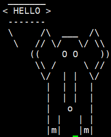

# Shell programming in Linux

## Shell scripting basics

> First line of Shell script should look like: 
* `#!/bin/bash`
* `#!/bin/sh`

After 2 special characters **#!**, 
it should contain the path to the interpreter - program that will try to interpret the text line by line and do what is required.

In case script don't have such first line, it will still work, but it will be interpreted by current shell and chances are, there will be some errors. 

<br><br>

*Simple script example*

```bash
cat  > ~/s1  << "EOF1"
#!/bin/bash
ls -l /usr/bin/
EOF1
chmod +x ~/s1

```

Try running this simple script:

`./s1`

Let's now understand what was done above.

We used method called _Here document_ to create the script and made it executable with `chmod`.
The script itself is a single `ls` command, that outputs detailed (-l) contents of directory _/usr/bin/_

Check the contents of the script you created:

```bash
cat ~/s1
```

<br><br>

## Positional Parameters

During running, shell scripts have access to special data from the environment:

* **$0** or **{$0}** - The name of the script
* **$1** or **{$1}** - The first argument sent to the script 
* **$2** or **{$2}** - The second argument sent to the script
...
* **$*** - all arguments as one
* **$#** - count/number of arguments

This enables to pass some data to the script by means of positional parameters.

> Example of positional parameters

```bash
cat  > ~/s2  << "EOF1"
#!/bin/bash
# Here we get the first positional parameter and provide it to "ls" command
ls -l ${1}
EOF1
chmod +x ~/s2

```

Now try running this simple script without any parameter:

```bash
./s2
```

> QUESTION: What directory did `ls` command list ?  Why ?

Now try providing one positional parameter

```bash
./s2 /tmp
```

```bash
./s2 /usr/sbin
```

As you see we pass the data to the script, which changes how `ls` command works.


Let's now pass more data. 
We will provide options to `ls` via first positional parameter, 
the directory to show via second and pattern to filter lines via third.

```bash
cat  > ~/s3  << "EOF1"
#!/bin/bash
ls ${1} ${2} | grep ${3}
EOF1
chmod +x ~/s3

```

First try running this script without parameters:

```bash
./s3
```

> EXPLAIN THE OUTPUT


Now try providing all 3 positional parameters

```bash
./s3 -lh /bin log
```

```bash
./s3 -r / l
```

### Example with Variables

The following script creates a variable called **NAME** and assigns the value "HELLO STUDENT".

Example of simple variable assignment usage

```bash
cat  > ~/v1  << "EOF1"
#!/bin/bash
NAME="HELLO STUDENT"
echo $NAME
EOF1
chmod +x ~/v1

```

Execute the above script, which will output the text to the terminal.

**Task 1: Modify the script to output 1-st positional parameter after HELLO STUDENT.**

**Task 2: Have fun with _cowsay_**

1. Install `cowsay` program
```bash
sudo yum -y install cowsay
```

2. Run it
```bash
cowsay Hi Shell Programmin student
```

It can draw different pictures and say the text you provide.


3. Create an alias `pxik` to draw **elephant** saying what you will give as parameter.
   1. List of pictures are available with
   ```bash 
   cowsay -l
   ```
   2. Find the option to provide **elephant** picture file as parameter
      1. ```bash
         cowsay -h
         ```
      2. ```bash
         man cowsay
         ```
   3. Your alias should work like `pxik HELLO`




4. Create the **script** which will do the same as **alias**. 

<br><br>

When you work in shell, there are already many defined shell variables.

**Global variables** (also called **environment variables**) - available to all shells. 
The `env` or `printenv` commands can be used to display environment variables. 

**Local variables** are visible only within the block of code.  
Using the `set` built-in command without any options will display a list of all variables 
(including environment variables) and functions.  

In a function, a local variable has meaning only within that function block. 

```bash
set | grep HIST
```

```bash
set | grep NAME
```

```bash
env | grep NAME
```


## Conditionals

Very frequently there is need to make decisions based on certain conditions. Conditions are expressions that after being evaluated return "yes" or "no" (i.e. true or false).

Most used is **if** conditional

Simple example is below:

```bash
cat  > ~/c1  << "EOF1"
#!/bin/bash
A=5
B=30

if [ $A -lt $B ]
then
        echo "$A < $B"
fi
EOF1
chmod +x ~/c1

```

Execute the above script, which will output the text to the terminal.

**Task: Modify the script to get 2 variables from 2 positional parameters**

<br><br>
Notice that in case **a** is NOT less that **b**, nothing is printed.
Let's add that variant too.

Edit the file and add 

```bash
else
        echo "$A > $B"
```
before `fi` line


if you run the above script without parameters you see output is not so pretty.
Now let's add additional check if parameters are present.

Add below code just after first line `#!/bin/bash`

```bash
if [[ $# < 2 ]] 
then 
  echo "Please provide 2 numbers as parameters"
  echo "Usage: $0 num1, num2" 
exit 
fi 
```

Now you may notice that even though we check for the number of parameters to be at least 2, 
if we give non-numeric parameter it will give error.


```bash
./c1 aaa 1 
```


To implement checking if 1st parameter is numeric, add below code just after above check `#!/bin/bash`

```bash
if [ $1 -eq $1 2>/dev/null ]
then
echo -n
else
echo "$1 not number"
exit
fi
```

Now check if it works

```bash
./c1 aaa 1 
```

But second parameter still is not checked.

```bash
./c1 1 aaa 
```

**Task: Modify the script to check 2nd positional parameter as well**


Shell script to check whether a number is positive or negative

```bash
#!/bin/bash
echo "Enter a Number"
read num

if [ $num -lt 0 ]
then
    echo "$num is Negative"
elif [ $num -gt 0 ]
then
    echo "$num is Positive"
else
    echo "$num is ZERO"
fi

```

### Task 
Modify script to get number from 1st positional parameter


## Functions

We see that in above code we add the same part for checking 1st parameter, then 2nd.
In case we don't want to repeat the same code twice, we can create a **function**.

```bash
cat  > ~/f1  << "EOF1"
#!/bin/bash
if [[ $# < 2 ]]
then
  echo "Please provide 2 numbers as parameters"
  echo "Usage: $0 num1, num2 ..."
exit
fi

isnumber () 
{ 
if [ $1 -eq $1 2>/dev/null ]
then
echo -n
else
echo "$1 not number"
exit
fi
}


a=${1}
b=${2}

isnumber $a
isnumber $b

if [ $a -lt $b ]
then
        echo "$a < $b"
else
        echo "$a > $b"

fi

EOF1
chmod +x ~/f1

```

You can see that the above script `f1' works the same way as 'c1',
but here we define and use function **isnumber**.


Other example of function

```bash
cat > ~/f2 << "EOF1"
#!/bin/bash 

exf () {  
echo "We learn $1" 
} 

exf Linux 
exf Shell
exf Programming in Linux
exf Shell Programming in Linux

EOF1
chmod +x ~/f2

```

> Here you may understand that INSIDE function **$1** means NOT 
> first parameter of the script, but first parameter of that function

Now notice that in last 2 lines only first word is printed.
Why?

**Task: Modify the script to print complete lines.**
**HINT: you need to use something else than $1** 


#### PRATICE
Based on previous use of funny `cowsay` program, create more flexible script `nkar` to get 2 parameters and provide to `cowsay`
1. what picture to draw
2. what text to say

When ready it should work like `nkar elephant HELLO`


## Sourcing Scripts

Sourcing script means including one script into another

It may be useful if you have a code block you may want to: 
* separate or 
* use in multiple scripts

Simple example of it is in `~/.bashrc`
```bash
cat ~/.bashrc
```

Here we see sourcing is used multiple times like:
```bash
if [ -f ~/.bash_aliases ]; then
    . ~/.bash_aliases
fi
```

Let's separate two blocks in above `f1` script and source them.

```bash
cat  > ~/f11-s1  << "EOFs1"
if [[ $# < 2 ]]
then
  echo "Please provide 2 numbers as parameters"
  echo "Usage: $0 num1, num2 ..."
exit
fi
EOFs1

cat  > ~/f11-s2  << "EOFs2"
isnumber () 
{ 
if [ $1 -eq $1 2>/dev/null ]
then
echo -n
else
echo "$1 not number"
exit
fi
}
EOFs2


cat  > ~/f11  << "EOF1"
#!/bin/bash

. ~/f11-s1

. ~/f11-s2

a=${1}
b=${2}

isnumber $a
isnumber $b

if [ $a -lt $b ]
then
        echo "$a < $b"
else
        echo "$a > $b"

fi

EOF1
chmod +x ~/f11

```

Note we didn't made `f11-s1` and `f11-s2` executable, because they will not be called directly.

## Loops

Example of `while` loop

```bash
#!/bin/bash
if [ -z $1 ]; then
echo "Usage: $0 number of loops"
exit
fi
clear
COUNTER=0
while [ $COUNTER -lt $1 ]
do
echo "State (for $1 seconds)"
echo "second:$COUNTER" 
echo "-- Users --"
w
echo "----------------"
/bin/sleep 1
clear
COUNTER=`expr  $COUNTER + 1`
done

```


Example of `for` loop


```bash
#!/bin/bash
echo "How do you like it:"
for (( i=1; i<=5; i++ ))
do
    for (( j=1; j<=i;  j++ ))
    do
     echo -n "$i"
    done
    echo ""
done

```


Count factorial of a number (with `for` loop)

```bash
#!/bin/bash
num=$1
fact=1
for((i=2;i<=num;i++))
{
  fact=$((fact * i))  #fact = fact * i
}
echo $fact
```

Count factorial of a number (with `while` loop)

```bash
#!/bin/bash
num=$1
fact=1
while [ $num -gt 1 ]
do
  fact=$((fact * num))  #fact = fact * num
  num=$((num - 1))      #num = num - 1
done

echo $fact
```

Count sum of all digits in a number with `while` loop

```bash
#!/bin/bash
num=$1
sum=0

while [ $num -gt 0 ]
do
    mod=$((num % 10))    #Split last digit by modulo 10 - remainder of a division by 10
    sum=$((sum + mod))   #Add that digit to sum
    num=$((num / 10))    #Divide num by 10 
done

echo $sum

```


### Arrays

_ARRAY=(value1 value2 ... valueN)_ 

Contents of an array element is available as  _${ARRAY[valueN]}_

Simple array example:

```bash
cat > ~/array.sh << "EOF1"
AR=( zero one two three four five ) # define the array 
echo 
echo "Whole array is:"
echo ${AR[*]}  # get the whole array 
echo 
echo "3-rd element is:"
echo ${AR[2]} # get the 3-rd element 
EOF1
chmod +x ~/array.sh

```


Advanced example working with arrays:


```bash
cat > ~/mkuniq.sh << "EOF1"
#!/bin/bash 
# Create an array "INPUT" from all positional parameters. 
INPUT=( 1 2 3 4 11 12 3 4 55 6 77 77 55 9 3) 
# 
echo "Initial array is:"
for VAR1 in ${INPUT[@]}; do 
    echo $VAR1 
done
echo
# Create another array "UNIQ" from the output of the 3 command pipe grouped togehter. 
# "tr" replaces spaces with newlines, so each element is now on separate line. 
# We operate with lines by sorting them with "sort" and then removing duplicates with "uniq" 
UNIQ=( $(echo ${INPUT[@]} | tr ' ' '\n' | sort | uniq) ) 
# 
echo "Modified array is:"
# Output each value from new array 
for VAR2 in ${UNIQ[@]}; do 

    echo $VAR2 
done
EOF1
chmod +x ~/mkuniq.sh

```

##### Task1: 
Modify script sort numbers correctly 

##### Task2: 
Modify script to:  
1. create array “INPUT” from all positional parameters 
2. output usage if no parameters are given 


